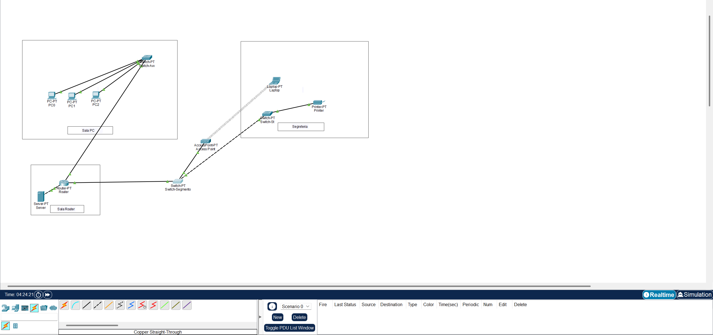

# Advanced Enterprise Network Architecture & Security Hardening

## ⚠️ Important Disclaimer & Academic Integrity
* **Personal & Educational Project:** This repository showcases a personal, educational hands-on project. It does **not** represent a real deployed corporate infrastructure, and "NexTech Solutions" is a fictional entity used solely for scenario-modeling purposes.
* **Academic Integrity Notice:** You are welcome to explore, study, and learn from this configuration. However, **plagiarism is strictly prohibited**. Do not copy, replicate, or claim this project, its documentation, or its network topologies as your own work for academic submissions, certifications, or professional portfolios.

---

## 📌 Project Overview & Requirements
The client, **NexTech Solutions** (a fast-growing tech startup), required a modern, scalable, and highly secure network infrastructure overhaul to protect their intellectual property and comply with modern cybersecurity standards. 

The architecture is built from scratch using Cisco Packet Tracer and achieves the following objectives:
* **Logical & Physical Segmentation:** Isolating high-privileged corporate resources (**Development Room - VLAN 10**) from general business operations (**Selling Room - VLAN 20**) and public networks (**Guest Wi-Fi - VLAN 40**) across multiple floors using an optimized VLSM (`/26`) subnetting scheme.
* **Automated IP Management:** Eliminating manual static IP mapping by deploying centralized, dynamic Cisco DHCP pools tailored to lease specific scopes per department.
* **Granular Traffic Control & Micro-segmentation:** Implementing strict firewall-like rules using Layer 3 Extended ACLs to prevent unauthorized lateral movement (e.g., blocking Sales and Guests from accessing the Developers' network), while surgically allowing access to specific services (HTTP/HTTPS to an internal corporate Web Server).
* **Infrastructure Hardening:** Securing inter-switch links by disabling dynamic trunking protocols (DTP), replacing unencrypted management access with SSH, and mitigating advanced Layer 2 attacks (such as *VLAN Hopping*) by isolating unassigned traffic into a dedicated "Blackhole" Native VLAN (VLAN 999).

---

## 🛠️ Network Topology Diagram

*(Make sure to upload your Packet Tracer screenshot to the repository with the name topology.png)*

---

## 📐 Core Technical Architecture

### 1. IP Subnetting Plan (VLSM /26 Split)
To maximize IP efficiency and accommodate up to 50+ hosts per department, a base private network of `192.168.10.0/24` was divided into four equal `/26` subnets:

| Department / VLAN | VLAN ID | Network Address | Subnet Mask | Default Gateway | Usable Host Range |
| :--- | :---: | :--- | :--- | :--- | :--- |
| **Development** | 10 | `192.168.10.0/26` | `255.255.255.192` | `192.168.10.1` | `192.168.10.2 - 192.168.10.62` |
| **Sales / Selling** | 20 | `192.168.10.64/26` | `255.255.255.192` | `192.168.10.65` | `192.168.10.66 - 192.168.10.126` |
| **Unassigned / Spare** | 30 | `192.168.10.128/26` | `255.255.255.192` | - | *Reserved for expansion* |
| **Guest Wi-Fi** | 40 | `192.168.10.192/26` | `255.255.255.192` | `192.168.10.193` | `192.168.10.194 - 192.168.10.254` |

### 2. Layer 2 Infrastructure & Hardening
* **Multi-Switch Stacking:** Deployed a core floor switch (`SW-Floor-1`) linked to an intra-office switch (`SW-Dev-Room`) to extend VLAN 10 across rooms seamlessly.
* **Trunk Security Hardening:** Disallowed dynamic trunk negotiation (`switchport nonegotiate`) on inter-switch and router links.
* **Native VLAN Exploitation Mitigation:** Moved the default Native VLAN from VLAN 1 to a dedicated, unused "Blackhole" VLAN (**VLAN 999**) across all trunks to prevent *VLAN Hopping* attacks.

### 3. Layer 3 Routing & Edge Connectivity
* **Router-on-a-Stick (ROAS):** Configured logical sub-interfaces on `Router0` (e.g., `Fa0/0.10`, `Fa0/0.20`, `Fa0/0.40`) with 802.1Q encapsulation to act as the default gateways for all internal subnets.
* **Automation:** Configured centralized DHCP pools on the router to automatically lease IP addresses, lease times, and DNS details dynamically based on the receiving VLAN.
* **Default Routing:** Bound `Router0` with a static default route (`0.0.0.0 0.0.0.0`) pointing to the ISP gateway (`203.0.113.2`) over a `/30` point-to-point public link for global internet access.

---

## 🔒 Implemented Security & NAT Policies (ACLs)

Traffic filtering and translation are handled via a combination of Standard and Extended Access Control Lists applied strategically on the router:

### ACL 1 - NAT Interesting Traffic (Global Configuration)
Unlike firewall rules, this **Standard ACL** is bound to the NAT process (`ip nat inside source list 1 interface ... overload`). It explicitly defines which internal private subnets are authorized to be dynamically translated into the single public IP address via **Port Address Translation (PAT)** for outbound Internet access:
* **Rule 1:** `access-list 1 permit 192.168.10.0 0.0.0.63` (Permits VLAN 10 Sviluppo)
* **Rule 2:** `access-list 1 permit 192.168.10.64 0.0.0.63` (Permits VLAN 20 Vendite)
* **Rule 3:** `access-list 1 permit 192.168.10.192 0.0.0.63` (Permits VLAN 40 Guests)

### ACL 101 - Sales Department Security (Inbound on Fa0/0.20)
Protects the Development segment while maintaining required business functionality:
* **Rule 1 & 2 (Permit Web Traffic):** Allows Sales hosts to initiate TCP connections to the internal Web Server (`192.168.10.2`) exclusively on ports `80` (HTTP) and `443` (HTTPS).
* **Rule 3 (Deny Corporate Inter-VLAN):** Blocks all other IP traffic originating from Sales destined for the Development subnet (`192.168.10.0/26`).
* **Rule 4 (Permit Any):** Allows global internet navigation (general web access / traffic permitted by NAT).

### ACL 102 - Guest Network Isolation (Inbound on Fa0/0.40)
Enforces a strict Guest WiFi policy:
* **Rule 1 (Deny to Internal Corp Network):** Instantly drops any packet coming from Guest WiFi (`192.168.10.192/26`) trying to reach the corporate networks.
* **Rule 2 (Permit Any):** Grants unrestricted internet browsing capabilities via NAT.

---

## 🧪 Verification & Testing Matrix (UAT)

Because Cisco IOS standard Extended ACLs are **stateless**, asymmetric traffic filtering was observed and verified during the User Acceptance Testing phase:

| Test Scenario | Source Device | Destination Device | Protocol / Port | Expected Result | Technical Behavior |
| :--- | :--- | :--- | :--- | :---: | :--- |
| **Intra-VLAN Communication** | PC-D1-1 (VLAN 10) | Server-Web (VLAN 10) | ICMP (Ping) | **SUCCESS** | Switched entirely at Layer 2 inside the local segment. |
| **Authorized Services** | Sales PC (VLAN 20) | Server-Web (VLAN 10) | HTTP (Port 80) | **SUCCESS** | Permitted explicitly by ACL 101 rules 1 & 2. |
| **Corporate Isolation** | Sales PC (VLAN 20) | Developer PC (VLAN 10) | ICMP (Ping) | **FAILED** | Dropped inbound on `Fa0/0.20` due to ACL 101 Rule 3. |
| **Asymmetric Filtering** | Developer PC (VLAN 10) | Sales PC (VLAN 20) | ICMP (Ping) | **FAILED** | The *Echo Request* reaches Sales successfully, but the *Echo Reply* coming back is dropped by ACL 101 on `Fa0/0.20` because ICMP return traffic is not authorized. |
| **Guest Isolation** | Guest Laptop (VLAN 40) | Any Corp PC (VLAN 10/20) | Any Protocol | **FAILED** | Dropped immediately at the router gateway via ACL 102 Rule 1. |
| **Global Navigation** | Any Network Host | Google DNS (`8.8.8.8`) | ICMP (Ping) | **SUCCESS** | Hits the standard `permit` rule on the interface, matches **ACL 1**, undergoes PAT translation, and routes through the ISP link. |

---

## 🚀 How to Run the Simulation
1. Download the `.pkt` file included in this repository.
2. Open it using **Cisco Packet Tracer**.
3. Use the **Simulation Mode** or the Desktop Command Prompt on hosts to replicate the UAT verification steps described above.
4. **Device Credentials:** The password to access privileged mode (`enable`) and remote management via console/VTY lines on all Switches and Routers is `cisco123`.
